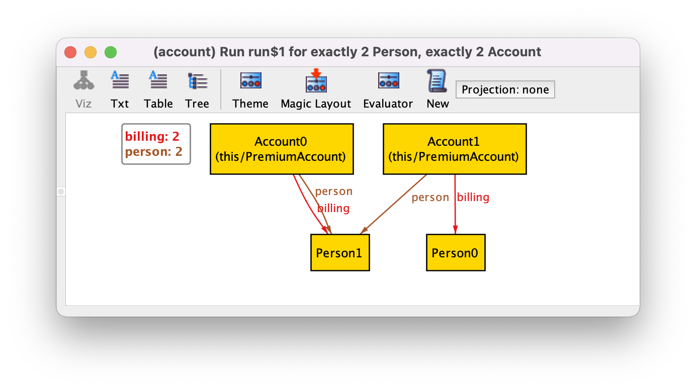

Потомки автоматически наследуют родительские поля.
И также могут определять свои.

```
sig Person {}
sig Account {
  , person: Person
}

sig PremiumAccount in Account {
  , billing: Person
}
```



Все атомы ```Account``` будут иметь поле ```person```,
в то время как все атомы ```PremiumAccount``` будут иметь
поля ```person``` и ```billing```.

Это также применимо к неявным фактам.
Если ```Account``` имеет неявный факт, то он автоматически будет применен к ```PremiumAccount```.

Переопределять связи нельзя, можно только добавлять новые.