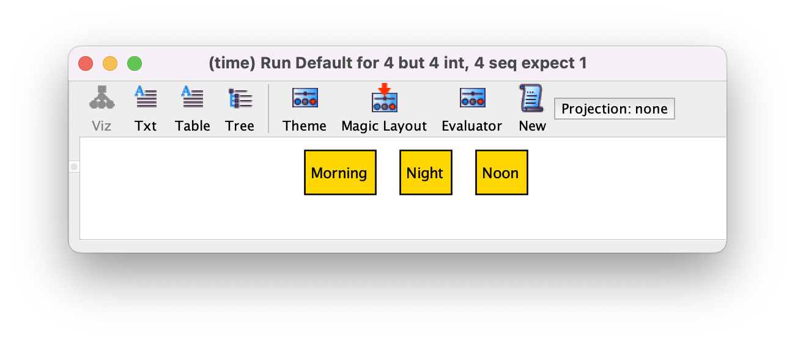

Enums - специальный вид сигнатур.

```
enum Time {Morning, Noon, Night}
```



enum всегда имеет определенные атомы внутри.
Атомы имеют порядок.

Можно использовать в фактах и предикатах.
Добавлять новые свойства к ним нельзя.

Если нужны перечисления со свойствами, то можно их эмулировать используя ```one```.

```
abstract sig Time {}

one sig Morning, Noon, Night extends Time {
    time: Time
}
```

А если использовать ```lone``` то можно делать перечисления с нефиксированным количеством элементов.

Каждый enum неявно импортирует **ordering**.
Следующий код невалидный:

```
enum A {a}

enum B {b}

run {some first}
```

Неоднозначность в том что должен вернуть ```first```, ```a``` или ```b```.
Если нужно использовать оба внутри динамической модели, то нужно использовать namespace при импорте **ordering**.
