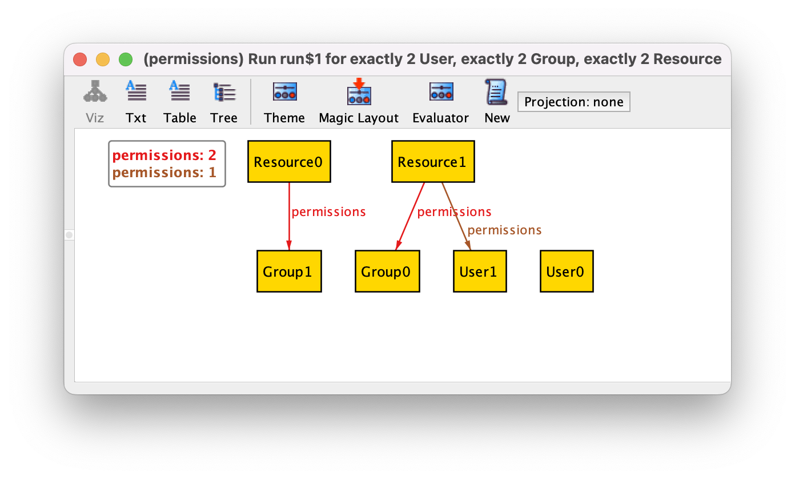

Поле может быть простым выражением над сигнатурами:

```
sig Resource {
  permissions: set (User + Group)
}
```



Выражение может содержить ```this```, которое ссылается на сам определенный атом:

```
sig Node {
  -- no self loops
  , edges: set Node - this
}
```


**Зависимым полем** называется такое в котором выражение зависит от значения других полей в атоме.
Зависимостями могут быть поля определенные в сигнатуре или в супертипе.

```
sig Item {}

sig Person {
  , favorite: Item
  , second: Item - favorite
}
```

