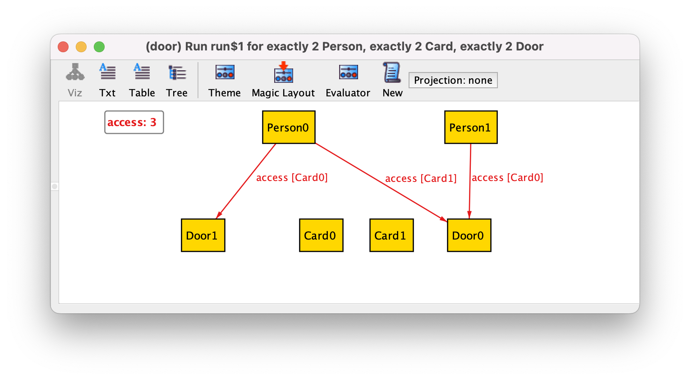
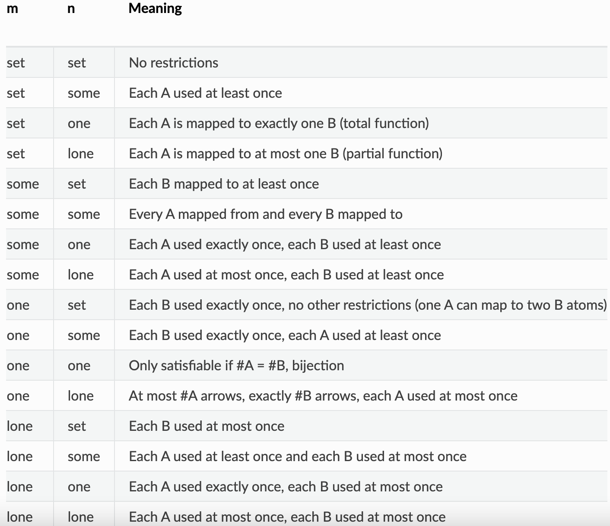

Сигнатуры могут иметь мультисвязи как поля:

```
sig Door {}
sig Card {}

sig Person {
  access: Card -> Door
}
```



```access``` троичная связь, каждый элемент в ней это связь вида ```Person -> Card -> Door```.

Мультисвязи имеют специальнай тип множественности: ```r: A m -> n B```.
Каждый элемент ```A``` соответствует ```n``` элементам ```B```, 
и ```m``` элементов ```A``` соответствуют каждому элементу ```B```.



Не все multiplicities будут приводить к валидными моделям. Например:

```
sig A {}
sig B {}
one sig C {
  r: A one -> one B
}

run {} for exactly 3 A, exactly 2 B
```

Т.к. ```r``` должно быть 1-1, и число сигнатур A и B различно, ничто не удовлетворяет модели.

```
Executing "Run run$1 for exactly 3 A, exactly 2 B"
   Solver=sat4j Bitwidth=4 MaxSeq=4 SkolemDepth=1 Symmetry=20 Mode=batch
   55 vars. 6 primary vars. 73 clauses. 65ms.
   No instance found. Predicate may be inconsistent. 3ms.
```

Используя этот же синтаксис можно сделать мультисвязи более чем троичными, но это в общем не рекомендуется.
