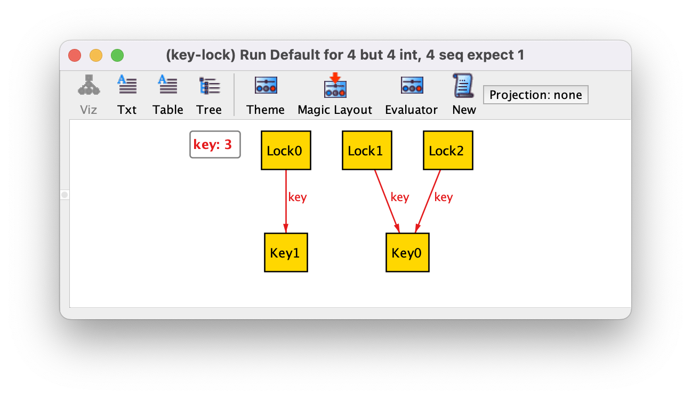

**Связи** добавляются в тело сигнатуры.
Тело сигнатуры это список связей, которые показывают как сигнатуры соединены друг с другом.
Связь в теле сигнатуры называется **полем**.


# [Люди и авто](people-and-cars.als)

```sig Registration {owner: Person, car: Car}```

Есть не только люди и автомобили, но и то какие люди какими автомобилями владеют.


# [Self-loop](self-loop.als)

```sig Node {edges: set Node}```

Связи могут ссылаться на ту же самую сигнатуру. Это валидно.


Alloy может генерировать модели в которых связь указывает от атома на него самого.
По этой причине иногда в модель надо добавлять ограничения такие как **факты** или **предикаты**.


# Множественность

Каждая связь имеет **множественность**, которая представляет как много атомов она может включать.


## one (по умолчанию для индивидуальных связей)

```sig A {r: one B}``` - есть только одно B в множестве.

```sig Lock {key: one Key}```

Каждый замок имеет только один ключ.
Это не гарантирует соответствия 1-1!
Один ключ может открывать два замка.
Из каждого замка только одна стрелка в ключ, но не указывается какой именно.



[key-lock.als](key-lock.als)


## lone (можно думать как про "optional")

```sig A {r: lone B}``` - либо есть только одно B в множестве, или множество пустое.

```sig Directory {parent: lone Directory}```

Каждая папка имеет только одного родителя, или не имеет родителя (корневая папка).


[directory.als](directory.als)


## set (по умолчанию для мультисвязей)

```sig A {r: set B}``` - в связи может быть любое количество B.

```sig Region {server: set User}```


[user-region.als](user-region.als)


## some

```sig A {r: some B}``` - в связи должно быть как минимум одно B.

```sig Book {by: some Author}```


[author-book.als](author-book.als)


## disj

```disj``` можно добавить к любому multiplicity чтобы гарантировать раздел (disjoint) среди всех атомов.
Раздел проходит между атомами из которых выходят стрелки.


```sig Key {lock: disj one Lock}``` - каждый ключ будет соответствовать различному замку.
Для всех ключей это соблюдается.
Если убрать ```disj``` то два ключа могут вести в один замок.
```one``` означает, что из ключа будет выходить только одна стрелка до замка.


```sig Key {locks: disj some Lock}``` - каждый ключ будет соответствовать одному или больше замков, но два ключа не будут подходить к одному замку.


[key-lock.als](key-lock.als)


## seq
