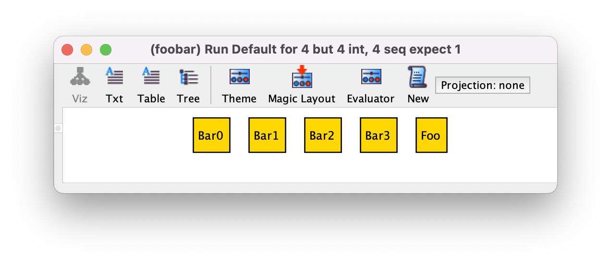

Множественность может быть не только у связей, но и у сигнатур.

```
one sig Foo {}
some sig Bar {}
//etc
```



- По умолчанию у сигнатур множественность ```set```, т.е. их может быть 0 или более в модели.
- ```one``` будет означать что в модели будет только один атом сигнатуры.
- ```some``` означает, что будет будет как минимум один.
- ```lone``` означает что будет 0 или 1.