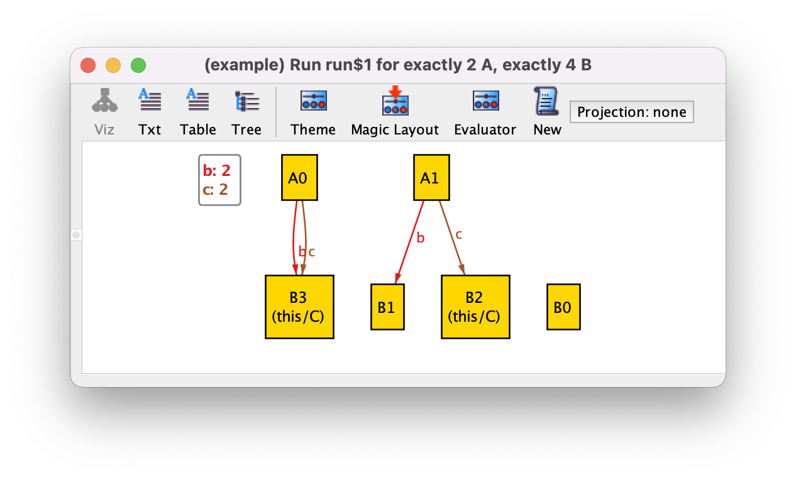

Все подтипы также являются их родительскими типами.

```
sig B {}
sig C in B {}

sig A {
 , b: B
 , c: C
}
```

Связь ```b``` может соответствовать атомам ```C```.
```c``` не может соответствовать элементам ```B```, которые не входят также в ```C```.



Если нужно соответствие элементам ```B```, которых нет в ```C```, то можно написать:

```
sig A {
  , b: B - C
}
```
