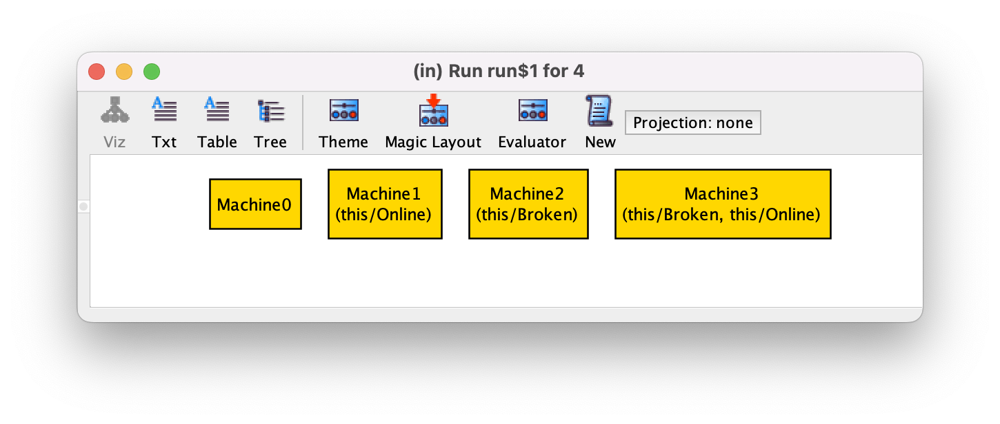
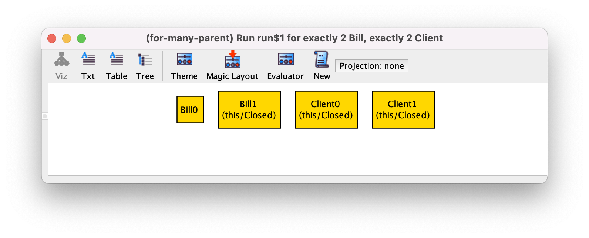
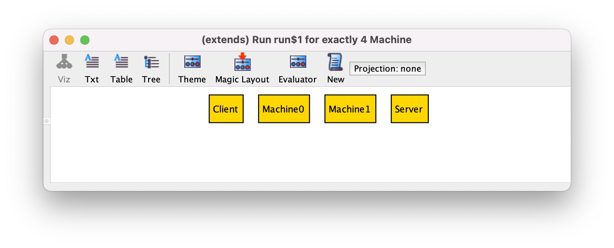
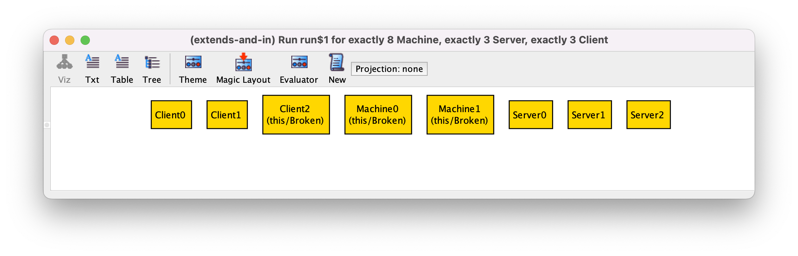
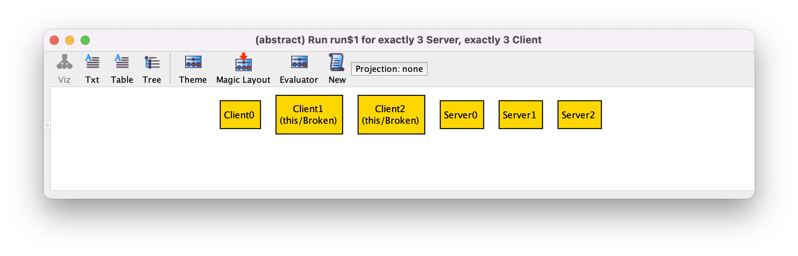

# ```in```

```sig Child in Parent``` создает инклюзивный подтип:
любые атомы ```Parent``` могут или не могут быть ```Child```.
Это также называется “subset subtype”.

```
sig Machine {}

sig Broken in Machine {}
sig Online in Machine {}
```

Любая машина может быть сломана, онлайн, или оба, или ничего.




# ```+```

Single inclusive subtype может быть определен для множества родительских сигнатур.
Для этого над родительскими сигнатурами используется union operator.

```
sig Bill, Client {}

sig Closed in Bill + Client {}
```




# ```extends```

```sig Child extends Parent``` создает подтип как ```in```.
В отличие от ```in``` Parent atom может соответствовать только одному расширению.

```
sig Machine {}

sig Server extends Machine {}
sig Client extends Machine {}
```

Машина может быть сервером, клиентом, или ничем, но не обоими.




# ```extends``` и ```in```

Что-то может принадлежать обоим ```extend``` и ```in``` подтипам.

```
sig Machine {}
sig Broken in Machine {}

sig Server extends Machine {}
sig Client extends Machine {}
```



Машина может быть сломанным сервером, или сломанным клиентом, или чем-то одним из трех, но не все сразу.


# ```abstract```

Если сделать сигнатуру абстрактной, то все этомы сигнатуры будут принадлежать расширениям.
Не будет атомов только супертипа без подтипов.
Если ничего не расширяет абстрактную сигнатуру, то она игнорируется.

```
abstract sig Machine {}
sig Broken in Machine {}

sig Server, Client extends Machine {}
```



Любая машина должна быть либо сервером, либо клиентом.
Она по прежнему может быть или не быть сломанной.

